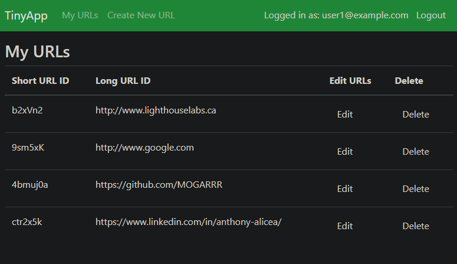
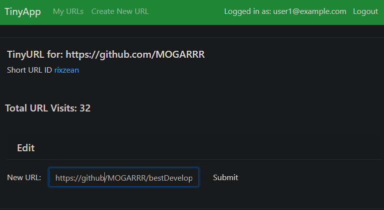

# TinyApp Project
# By Anthony Alicea (https://github.com/MOGARRR)

TinyApp is a full stack web application built with Node and Express that allows users to shorten long URLs (à la bit.ly). Users can make an account to create short urls to use and share any of their favorite websites. **TinyApp, big convenience**
## Features
### Account users can:
- Create short urls for your favorite websites

- Edit, delete, and share your urls with anyone

- See and track the number of engagment for your urls

## Final Product

## Dependencies

- Node.js
- Express
- EJS
- bcryptjs
- cookie-session
- method-override
## Getting Started

- Install all dependencies (using the `npm install` command).
- Run the development web server using the `node express_server.js` command.